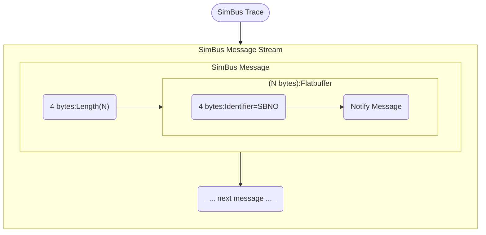

# Wireshark Dissectors


[Installation](#Installation) / [Usage](#Usage) / [Examples](#Examples)

[Dissector: SimBus Protocol](#SimBus-Protocol)


## Installation

```bash
# Install Wireshark.
$ sudo apt install wireshark
$ sudo usermod -aG wireshark $USER
# (Restart terminal for changes to take effect.)

# Create a Wireshark plugin folder.
$ mkdir -p ~/.local/lib/wireshark/plugins

# Copy dissectors.
$ git clone https://github.com/boschglobal/dse.schemas
$ cp dse.schemas/wireshark/*.lua ~/.local/lib/wireshark/plugins/
$ ls ~/.local/lib/wireshark/plugins/
simbus_dissector.lua
```


## Usage

```bash
# Using the example SimBus trace.
$ cp dse.schemas/wireshark/examples/simbus_binary.bin ./simbus.bin

# Convert a raw SimBus trace to a PCAP suitable for use by Wireshark.
$ hexdump -C simbus.bin > simbus.hex
$ text2pcap -u 2159,2159 simbus.hex simbus.pcap

# Open in Wireshark.
$ wireshark simbus.pcap
```


## Dissectors

### SimBus Protocol

SimBus Notify Messages; Flatbuffers encoded streaming format, with size prefixed buffers, and Flatbuffers file identifier `SBNO`.

* [Schema Definition][simbus_notify_fbs]
* [Flatbuffer Builder Reference][flatbuffer_builder]


__Streaming format:__



## Examples

* dse.schemas / wireshark / examples /
    * `simbus_binary.bin` - Collected from DSE ModelC example: [Binary Model Simulation][example_simbus_binary].
    * `simbus_ncodec.bin` - Collected from DSE ModelC example: [NCodec Model Simulation][example_simbus_ncodec].


<!---  Links --->
[simbus_notify_fbs]: https://github.com/boschglobal/dse.schemas/blob/main/schemas/flatbuffers/simbus_notify.fbs
[flatbuffer_builder]: https://github.com/dvidelabs/flatcc/blob/master/doc/builder.md
[example_simbus_binary]: https://github.com/boschglobal/dse.modelc/tree/main/dse/modelc/examples/binary
[example_simbus_ncodec]: https://github.com/boschglobal/dse.modelc/tree/main/dse/modelc/examples/ncodec
